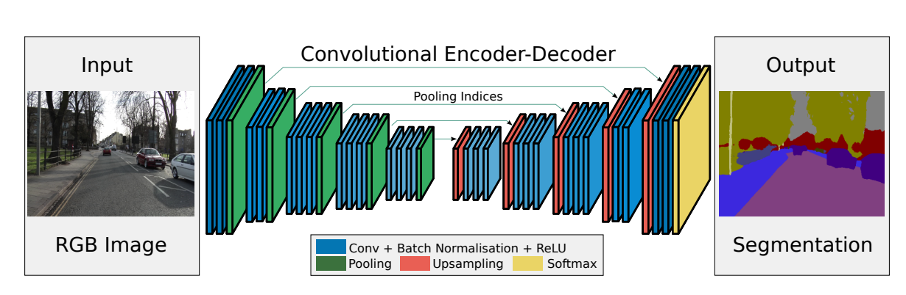

# DeepGlobeRoadExtraction

This project was designed as a solution to the 2018 DeepGlobe Road Extraction challenge dataset posted on Kaggle. This challenge revolves around being able to scan detailed 1024x1024 satellite images of cities, towns and villages, and being able to extract the roads from this image. To solve this challenge, I created a from-scratch PyTorch implementation of the SegNet model, which uses a decoder-encoder architecture (somewhat similar to U-Net) to perform the binary image segmentation needed for this task. A diagram of the model architecture can be found below, and the code for this implementation can be found in the `model.py` file. 

Outside of the model implementation, here's a brief outline of the other code files in this repository:
- `data.py`: Contains a full implementation of a custom PyTorch dataset definition for the dataset, using libraries such as NumPy and Pillow to write `__init__`, `__len__`, and `__getitem__` methods.
- `files.py`: Just a quick helper method to ensure that all the files in the dataset were installed successfully and that there's no data missing from the dataset, as that would affect the training of the model.
- `utils.py`: Contains two main helper methods: `clean_dataset()` and `get_dataloaders()`. The `clean_dataset()` method helps organize the dataset by systematically renaming and pairing all the corresponding images together. The initial dataset download esssentially gives the files matching random numbers as names, which is not very convenient for defining a PyTorch dataset, so this method helps fix that. Additionally, the `get_dataloaders()` method helps load in the dataloaders for the training and validation sets based on the neccesary hyperparameters. 
- `train.py`: Contains the model's main training loop, which uses CUDA GPU acceleration for faster and more effective training. Additionally, it contains the hyperparameters needed for fine-tuning the model. The TensorBoard support at the bottom of the file is a work in progress, and an attempt to visualize the training metrics of the model.

The model is currently in the process of being trained and evaluated to determine its final accuracy.